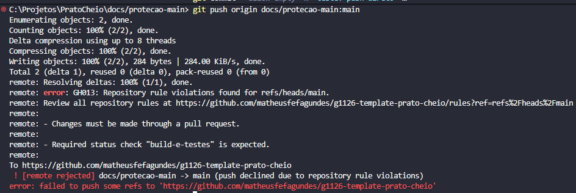

# Evidência: proteção da branch main

## 1. Print da regra



Regras ligadas (Settings > Rules > Rulesets, `protecao-main`, Active, bypass list vazia):
- Restrict deletions
- Block force pushes
- Require a pull request before merging (1 aprovação)
- Require status checks to pass (`build-e-testes`)

## 2. Push direto na main, recusado

Comando: `git push origin docs/protecao-main:main`

```
remote: error: GH013: Repository rule violations found for refs/heads/main.
remote: Review all repository rules at https://github.com/matheusfefagundes/g1126-template-prato-cheio/rules?ref=refs%2Fheads%2Fmain
remote:
remote: - Changes must be made through a pull request.
remote:
remote: - Required status check "build-e-testes" is expected.
remote:
To https://github.com/matheusfefagundes/g1126-template-prato-cheio
 ! [remote rejected] docs/protecao-main -> main (push declined due to repository rule violations)
error: failed to push some refs to 'https://github.com/matheusfefagundes/g1126-template-prato-cheio'
```

## 3. Quem ligou e quando

Regra ligada por Matheus Ferreira Fagundes em 18/09/2026.
